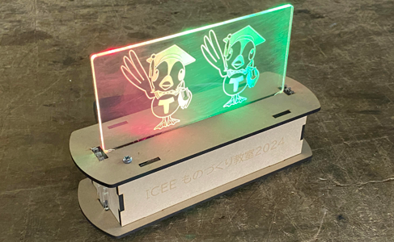

> Open this page at [https://k8w-r2k2.github.io/pxt-makeledstand/](https://k8w-r2k2.github.io/pxt-makeledstand/)

## 鳥大ものづくり教室「LEDスタンドを作ろう！」

このプロジェクトは，「LEDスタンドを作ろう！」のプログラム編で利用する[MakeCode Maker](https://maker.makecode.com/)の拡張機能です．  
家でプログラミングの続きをするときは，下の使い方を見てください．  

## 使い方

詳しい方法はイベントのときに配ったテキストを確認してください．ここでは，プログラミングを始めるまでのステップを紹介します．  

1. 下のURLからMakeCode Makerにアクセスします．  
    https://makecode.com/_ViLCV9UvPRfW  
  
1. 右上に表示されている「Edit」をクリックします．  
  
1. テキストをよく見てプログラミングをしてみよう！

## プログラム例  

### グラデーション表示

https://site.icee.tottori-u.ac.jp/home/

## Use as Extension

This repository can be added as an **extension** in MakeCode.

* open [https://maker.makecode.com/](https://maker.makecode.com/)
* click on **New Project**
* click on **Extensions** under the gearwheel menu
* search for **https://github.com/k8w-r2k2/pxt-makeledstand** and import

## Edit this project 

To edit this repository in MakeCode.

* open [https://maker.makecode.com/](https://maker.makecode.com/)
* click on **Import** then click on **Import URL**
* paste **https://github.com/k8w-r2k2/pxt-makeledstand** and click import

## Blocks preview

This image shows the blocks code from the last commit in master.
This image may take a few minutes to refresh.

#### Metadata (used for search, rendering)

* for PXT/maker

